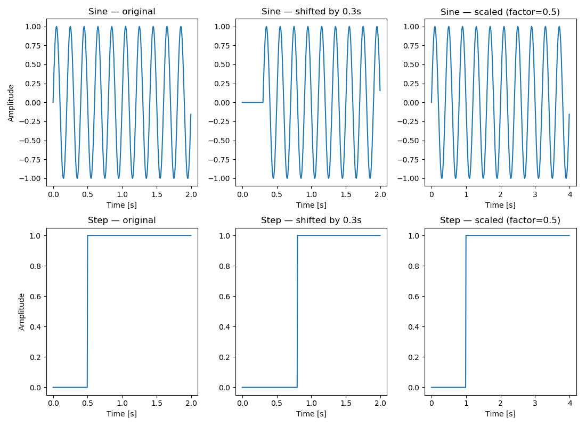

# Signals and Systems Project (5168732)

## Overview
This repository contains my coursework for the *Signals and Systems with Python* project.  
The aim is to practice generating basic signals and applying simple operations to them using **Python**, **NumPy**, and **Matplotlib**.  

## Repository Contents
- **signals.py**  
  Provides signal generators:  
  - `generate_sine_wave(...)` → produces a sine wave.  
  - `generate_step_function(...)` → produces a step signal.  

- **operations.py**  
  Provides operations on signals:  
  - `time_shift(...)` → shifts a signal forward or backward in time.  
  - `time_scale(...)` → stretches or compresses a signal along the time axis.  

- **run.py**  
  Main script that:  
  1. Creates a sine wave and a step signal.  
  2. Applies shifting and scaling operations.  
  3. Plots the original and modified signals.  

- **README.md**  
  Project description and usage guide.  

## How to Run
First install the required packages:
pip install numpy matplotlib

Then run:
python run.py

## Testing

All main functions are tested automatically using **pytest**.

To run the tests, a terminal is opened in the project folder and type:
python -m pytest

It showes that everything is working correctly, by giving the following output:

==================== test session starts ====================

collected 3 items

test_signals.py ...                                    [100%]

===================== 3 passed in 0.07s =====================

This confirms that all implemented functions behave as expected.

## Example Result

Executing run.py will open plots like the one below:

First row: sine wave → original, shifted, and scaled

Second row: step signal → original, shifted, and scaled

## Project Configuration

The project includes a pyproject.toml file that defines metadata and dependencies.
This file ensures that the project can be installed and executed consistently across environments.

## Author

Paul Smit
TU Delft – AESB2122-24: Signals and Systems with Python
